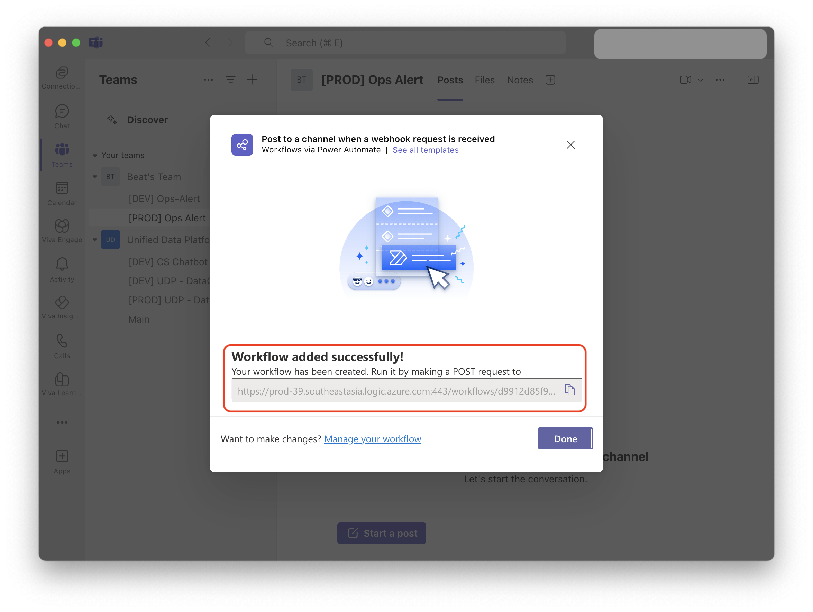

# คู่มือการสร้าง Channel และ Workflow ใน Microsoft Teams

## ขั้นตอนการสร้าง Channel และ Workflow

### ขั้นตอนที่ 1: หากยังไม่มีทีมใน Microsoft Teams

- สร้่าง Team และ Channel ใหม่

### ขั้นตอนที่ 2: หากมี Teams และไม่มี Channel

- สร้าง Channel ใหม่
- เลือกทีมที่ต้องการสร้าง channel
- คลิกที่ปุ่ม "..." ด้านข้างชื่อทีม
- เลือก "Add channel"
- ตั้งชื่อ channel และกำหนดการตั้งค่าต่างๆ
- คลิก "Create"

### ขั้นตอนที่ 3: ตั้งค่าการเชื่อมต่อ Workflow กับ Channel

- เลือกทีมและ channel ที่ต้องการ
- คลิกที่ปุ่ม "..." ด้านข้างชื่อทีม
- คลิกที่ Workflows

- เลือก Workflows ในการส่งข้อความ เช่น "Post to a channel when webhook is recieved"

- สามารถเปลี่ยนชื่อ Workflows ได้ตามต้องการ
- คลิก "Next"

### ขั้นตอนที่ 4: ตรวจสอบ Workflow และรับ Webhook URL

- ตรวจสอบการตั้งค่าทั้งหมด

- คัดลอก Webhook URL ที่ได้

## หมายเหตุ
- เก็บ Webhook URL ไว้อย่างปลอดภัย
- ตรวจสอบให้แน่ใจว่า workflow ทำงานตามที่ต้องการ
- สามารถทดสอบการทำงานได้โดยการส่งข้อความใน channel