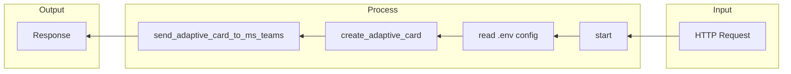

```mermaid
flowchart RL
    A[HTTP Request] --> B[start]
    B --> C[read .env config]
    C --> D[create_adaptive_card]
    D --> E[send_adaptive_card_to_ms_teams]
    E --> F[Response]
    
    subgraph Input
    A
    end
    
    subgraph Process
    B
    C
    D
    E
    end
    
    subgraph Output
    F
    end
``` 